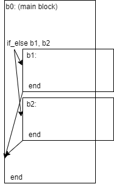

## Control flow part one

Prerequisites:
- [X] Basic blocks
- [X] Comparison functions

### Steps

1. Introduce an `if_else` instruction.
It takes two arguments: `then: BlockIdx` and `else: Option<BlockIdx>`.
The semantics: if the value popped of the stack is a non-zero integer,
transfer control flow to the *then* block. If it's zero, transfer
to the *else* block, or to the next instruction if *else* is None.

2. To ensure regular control flow (no goto-ish jumps), every block
can appear as an argument to the `if_else` instruction zero or one times, except
for the main block. Therefore, the blocks form a parent/child relationship, where every
block (except for the main block) has exactly one parent block.

3. Introduce new `end` instruction semantics.
If the block terminated by the instruction isn't the main block,
the instruction returns control flow to its parent.

4. To record where the `end` instruction returns to,
a metadata field "direction" or "parent" or an alternative will be added to every instruction.

5. Introduce a `return` instruction. This (obviously) immediately returns from a function.