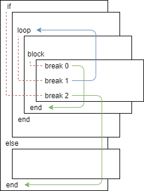

## Control flow part two

### A note about WebAssembly control flow
The wasm semantics considering the `br` (and `br_if`) instructions are
particularly unusual and imo difficult to understand.

Here's a quick explainer:

There's two types of basic blocks: the "block" block and the "loop" block.
The "block" block behaves sort of ordinarily: executes the code inside it and exit once it reaches the end.
The "loop" block is where the surprise is: 
*when execution reaches the end of the block, the block is exited as well*.
In order words, there's no implicit looping.

That's where the "break" instructions come in. Every break instruction has an associated index.
This is an index of a block it refers to, with the last (innermost) block having index zero.

The difference is that when a break instruction is associated with a **block** block,
it **jumps forward to the end of the block** when executed.
Whereas when associated with a **loop** block,
it **jumps backwards to the beginning of the block**, as you can see below:



### Steps

1. Introduce a `Loop(inner_block)` instruction. Its behavior is defined
as infinitely repeating the code inside the block.
It's compiled to wasm as `(block (loop (..inner block code.., br 0)))`.
The break at the end jumps back to the "loop" instruction and repeats the code.

2. Introduce a `Break` instruction. This breaks out of the innermost loop defined via `Loop()`.
In the simplest case, it compiles like: `(block (loop (..., br 1, ..., br 0)))`. Here, the break
instruction jumps to the end of the "block" block, therefore avoiding the "br 0" at the end.

However, there's a complication with the `IfElse` instruction, which also
compiles to a webassembly block. For example for the following IR:
```
Loop {
    ...
    IfElse {
        Break
    }
}
```
The webassembly must look like:
```
block (    <-----2--|
    loop (       1--|
        ...         |
        if (     0--|
            br 2 ---|
)))
```
As a solution I propose:

3. To every block where possible, add an integer metadata field called "innermost_loop_distance".
This integer is calculated as follows:
    * for every `Loop` instruction, the block it contains has distance 0
    * for every `IfElse` instruction, the block(s) it contains have a distance equal to the current block plus one.

Then, every `Break` instruction compiles to `br n`, where `n` is the innermost_loop_distance of this block + 1

4. For multiple purposes, add a tag to every block which specifies it
as either the "main" block, or a "if_else" block, or a "loop" block, depending on how it's used.
This can be used for simple reasoning about the control flow and stems from the requirement
that every block be used at most once.