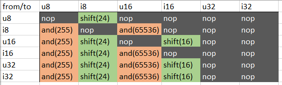

## Numerics

Numerics include the addition of 8-bit and 16-bit integers as well as operations on them.

This will mean adding new integer types but also modifying instructions,
because as of now, integer instructions assume they work with 32-bit integers.

For simplicity reasons, 64-bit integers are not a part of this draft.

There are three possibilities on how to modify the instructions:
1. Add a whole new set of instructions for every bitwidth: `I32Add`, `I16Add`, `I8Add`...
This may be the technically simplest solution but it would require the most refactoring.
2. Add a field `BitWidth` to integer instructions: `IAdd -> IAdd(BitWidth)`, etc.
This makes the user responsible for providing the correct types.
3. Add a metadata field `bitwidth`. This would amount to NO modifications of the instructions
whatsoever. However, it does make us (the verifier) responsible for inferring the bit widths.

## Notes concerning implementation
WebAssembly natively supports *int32* (and *int64*) types for all instructions and smaller
integers for some instructions (such as memory load/store).

Therefore the absolute most of the instructions for smaller bitwidths will be implemented
more like polyfills than 1-to-1 WASM instructions.

Below is a table of all of the polyfills:

|  op  |uint32   | signed int32 |  uint16         | signed int16          | uint8         | signed int8           |
|------|---------|--------------|-----------------|-----------------------|---------------|-----------------------|
| IAdd |`i32.add`|  `i32.add`   |`i32.add & 65536`|`(i32.add << 16) >> 16`|`i32.add & 255`|`(i32.add << 24) >> 24`|
| ISub |`i32.sub`|  `i32.sub`   |`i32.sub & 65536`|`(i32.sub << 16) >> 16`|`i32.sub & 255`|`(i32.sub << 24) >> 24`|
| IMul |`i32.mul`|  `i32.mul`   |`i32.mul & 65536`|`(i32.mul << 16) >> 16`|`i32.mul & 255`|`(i32.mul << 24) >> 24`|
| IDiv |`i32.div_u`| `i32.div_s`  |`i32.div_u`  |`(i32.div_s << 16) >> 16`|  `i32.div_u`  |`(i32.div_s << 24) >> 24`|
| Itof |`f32.convert_i32_u`|`f32.convert_i32_s`|`f32.convert_i32_u`|`f32.convert_i32_s`|`f32.convert_i32_u`|`f32.convert_i32_s`|
| Ftoi (see note) |`i32.trunc_f32_u`|`i32.trunc_f32_s`|`i32.trunc_f32_u`|`i32.trunc_f32_s`|`i32.trunc_f32_u`|`i32.trunc_f32_s`|
| ICmp.Eq/Ne |`i32.eq/ne`|`i32.eq/ne`|`i32.eq/ne` |`i32.eq/ne`            |`i32.eq/ne`    |`i32.eq/ne`     |
|ICmp.Lt/Gt/Le/Ge|`i32.*_u`|`i32.*_s`| `i32.*_u`  |`i32.*_s`              |`i32.*_u`      |`i32.*_s`       |
| Read |`i32.load`|`i32.load`   | `i32.load16_u`  |    `i32.load16_s`     |`i32.load8_u`  |`i32.load8_s`   |
|Write |`i32.store`|`i32.store` | `i32.store16`   |      `i32.store16`    |`i32.store8`   |`i32.store8`    |

where & means `i32.and`, << means `i32.shl`, >> means `i32.shr_s`

note about Ftoi: the `trunc_*` instructions trap on unexpected values whereas the `trunc_sat_*` instructions saturate into ordinary values

The rules for conversions are:

where `and(X)` means the WASM sequence `i32.const X, i32.and`
and `shift(X)` means the WASM sequence `i32.const X, i32.shl, i32.const X, i32.shr_s`.

Notably, this means that **converting to i32/u32 is always a no-op**.

## Steps
1. Add uint32 and other types into the Type enum
2. During the verification process add the types to the instructions that need them (see table above)
3. Adjust the emitter
Implementation note: from the WASM perspective, all smaller types actually compile to `i32`.
4. Add a conversion instruction `IConv(DestType)` to convert between integers.